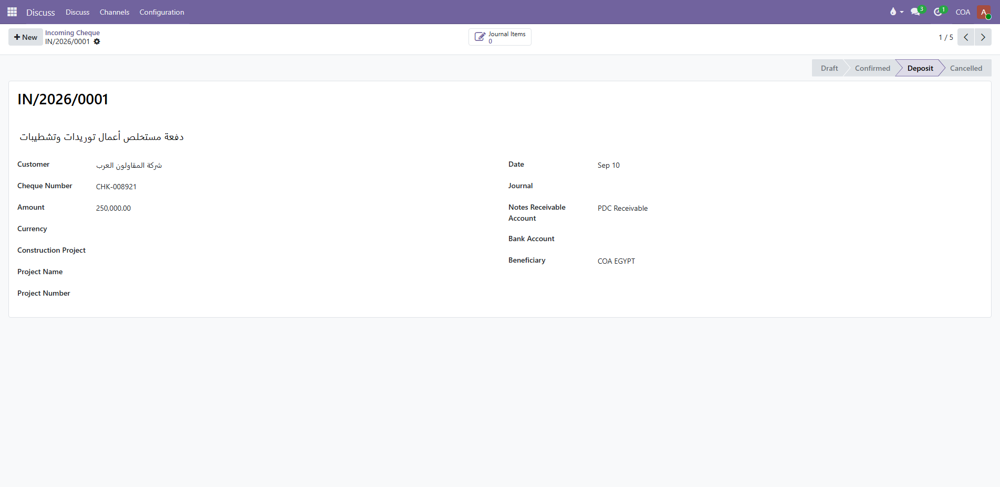
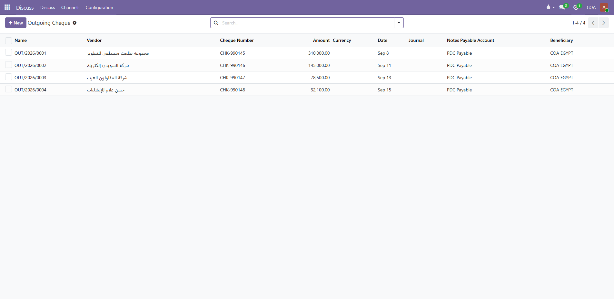

  
  <h1>COA Cheque Management | نظام إدارة الشيكات والأوراق المالية</h1>
  
<strong>حل متكامل واحترافي لإدارة دورة حياة الشيكات الواردة والصادرة على منصة Odoo 19</strong>

  

    
    
    
    
  

---

## 📌 نبذة عامة (Overview)
موديول **COA Cheque Management** يوفر نظاماً محاسبياً دقيقاً وشاملاً لمتابعة وإدارة الأوراق التجارية والشيكات البنكية (الواردة والصادرة) بدءاً من تاريخ استلامها أو إصدارها وحتى إيداعها أو تسويتها بالبنك مع الربط الكامل والتلقائي بقيود اليومية المحاسبية وشجرة الحسابات.

---

## 🚀 المميزات الرئيسية (Key Features)

- ✅ **إدارة الشيكات الواردة (Incoming Cheques):** تسجيل شيكات العملاء، أرقام الشيكات، البنوك، التواريخ، والمبالغ.
- ✅ **إدارة الشيكات الصادرة (Outgoing Cheques):** إصدار ومتابعة شيكات الموردين، مقاولي الباطن، والمصروفات.
- ✅ **دورة حياة متكاملة (Full Lifecycle):**
  - مسودة `Draft` ➔ تأكيد `Confirmed` ➔ إيداع أو تسوية `Deposit / Cheque Settlement` ➔ إلغاء أو ارتداد `Cancelled`.
- ✅ **التكامل المحاسبي الآلي (Auto Journal Entries):**
  - إنشاء قيود اليومية تلقائياً لحسابات أوراق القبض (Notes Receivable) وأوراق الدفع (Notes Payable).
- ✅ **الربط بالمشاريع وعقود المقاولات:** تخصيص الشيكات للمشاريع ومراكز التكلفة لتتبع دقيق للسيولة.
- ✅ **دعم العملات المتعددة (Multi-Currency):** دعم العملات المحلية والأجنبية مع فروق العملة.
- ✅ **صلاحيات وصول دقيقة (Access Security):** تحكم صارم بصلاحيات العرض والإدخال والاعتماد المالي.

---

## 📸 لقطات الشاشة الحية (Live Screenshots)

### 1. جدول الشيكات الواردة (Incoming Cheques List)

### 2. تفاصيل الشيك الوارد في مرحلة الإيداع (Incoming Cheque Form - Deposit State)

### 3. جدول الشيكات الصادرة (Outgoing Cheques List)

### 4. تفاصيل الشيك الصادر في مرحلة التسوية (Outgoing Cheque Form - Settlement State)

---

## 🛠️ المواصفات التقنية (Technical Details)
- **Technical Name:** `coa_cheque_management`
- **Odoo Version:** `19.0.1.0.0`
- **Dependencies:** `base`, `account`, `utm`
- **License:** `LGPL-3`
- **Author:** `Community of accountants (COA-Egypt)`
- **Website:** [https://www.coa-egy.com](https://www.coa-egy.com)

---

## 📥 التثبيت والتشغيل (Installation)
1. قم بنسخ مجلد `coa_cheque_management` إلى مسار `addons_path` في ملف إعدادات أودو `odoo.conf`.
2. قم بتحديث قائمة التطبيقات (`Update Apps List`) من واجهة أودو بعد تفعيل وضع المطور (`Developer Mode`).
3. ابحث عن `COA Cheque Management` واضغط على **Install**.

---

  
<strong>Community of Accountants (COA-Egypt)</strong>

  
<em>LEARN • APPLY • GROW</em>

