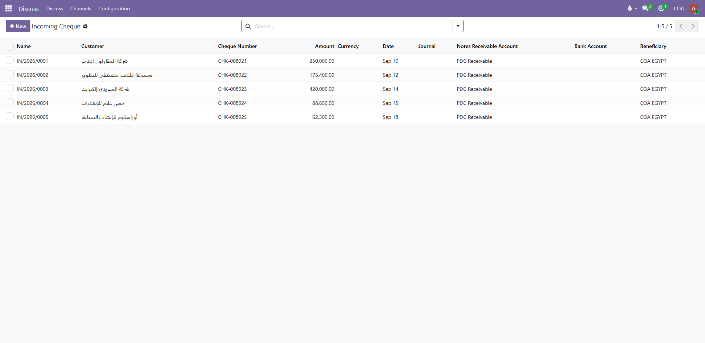
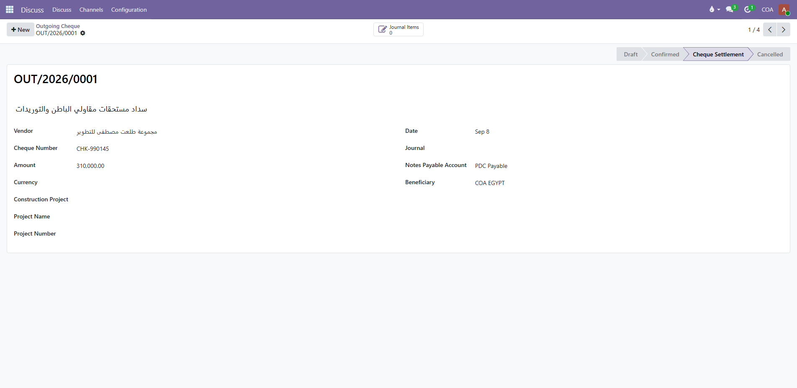

<div align="center">
  
  <h1>COA Cheque Management | Odoo Financial App</h1>
  <p><strong>Comprehensive Lifecycle and Accounting Management for Incoming &amp; Outgoing Cheques</strong></p>

  <p>
    <a href="https://odoo.com"></a>
    <a href="https://www.coa-egy.com"></a>
    
    
  </p>
</div>

---

## 📌 Overview

**COA Cheque Management** is an enterprise-grade financial app built for Odoo 19, 18, and 17. It provides treasury and accounting teams with complete control over commercial paper and bank cheques (both customer PDCs and vendor payment issuances), from initial leaf registration to bank deposit, clearance, or bounce reversal with automated double-entry journal creation.

---

## 🚀 Key Features

- ✅ **Incoming Cheques Management (Customer PDCs):** Record customer receipts, drawer details, bank branches, cheque numbers, and due dates.
- ✅ **Outgoing Cheques Management (Vendor Payments):** Issue cheques to suppliers and subcontractors with checkbook sequence tracking.
- ✅ **Complete Status Pipeline:**
  - `Draft` ➔ `Confirmed` ➔ `Under Collection` ➔ `Cleared / Done` (or `Bounced / Reversed`).
- ✅ **Automated Double-Entry Accounting:**
  - Automatic debit/credit lines for Notes Receivable, Notes Payable, Cheques Under Collection, and Bank Accounts.
- ✅ **One-Click Bounce & Reversal Engine:**
  - Instant reversal of journal entries for returned or NSF cheques, automatically restoring customer or vendor balances.
- ✅ **Multi-Currency & Multi-Bank Support:**
  - Support for local and foreign currencies with real-time exchange rates and multi-bank clearing queues.
- ✅ **Analytical Accounting & Project Distribution:**
  - Tag cheques with cost centers and analytical accounts for granular project profitability analysis.
- ✅ **Bilingual Interface:** Fully localized in English (`en_US`) and Arabic (`ar_001`).

---

## 📸 Live Application Previews

### 1. Incoming Cheques List View


### 2. Incoming Cheque Detail Form & Status Pipeline


### 3. Outgoing Cheques List View


### 4. Outgoing Cheque Detail & Bank Clearing Form


---

## 💻 Installation & Quick Start

1. Clone or download this repository into your custom addons directory:
   ```bash
   git clone https://github.com/Ahmed128aboshady/coa_cheque_management.git
   ```
2. Make sure the folder `coa_cheque_management` is within your Odoo `addons_path`.
3. Restart your Odoo server and enable Developer Mode.
4. Navigate to **Apps ➔ Update Apps List**.
5. Search for **COA Cheque Management** and click **Activate / Install**.
6. Configure intermediate accounts in **Accounting ➔ Configuration ➔ Settings**.

---

## 📄 License & Maintainer

- **License:** LGPL-3
- **Author:** Community of Accountants (COA-Egypt)
- **Website:** [https://www.coa-egy.com](https://www.coa-egy.com)
- **Email:** `ahmedaboshady128@gmail.com`
